# ClipTag
Утилита формирования тегов с правилами для 4PDA

### Описание:
* Приложение ClipTag позволяет сформировать тег с правилами форума 4PDA
* Для доступа к основному функционалу приложения необходимо авторизоваться в **ClipTag ID**

### Особенности:
1. Android 4.4 и выше
2. Светлая и тёмная темы
3. Темная тема - AMOLED
4. Большинство разделов форума 4PDA уже доступны в приложении
5. Множественный выбор правил
6. По умолчанию в режиме предосмотра доступен только кураторский тег
7. Для активации модераторского и предупреждающего тегов - обращаться к [**Keddnyo**](https://4pda.to/forum/index.php?showuser=8096247)

### Как пользоваться:
1. Выберите раздел
2. Нажмите на правило чтобы сразу перейти к предосмотру
3. Зажмите пункт правил чтобы включить режим множественного выбора пунктов правил
4. Нажмите кнопку копировать чтобы скопировать текст в буфер обмена
5. Либо нажмите на кнопку отправить чтобы скопировать правила с конкретным тегом, откроется приложение (если в Android настроены поддерживаемые приложением ссылки) либо в браузере.

### Скриншоты:
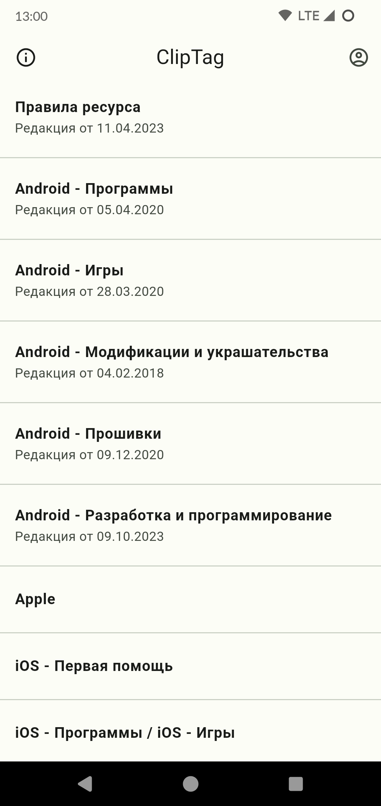 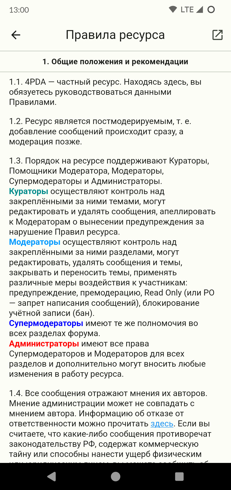 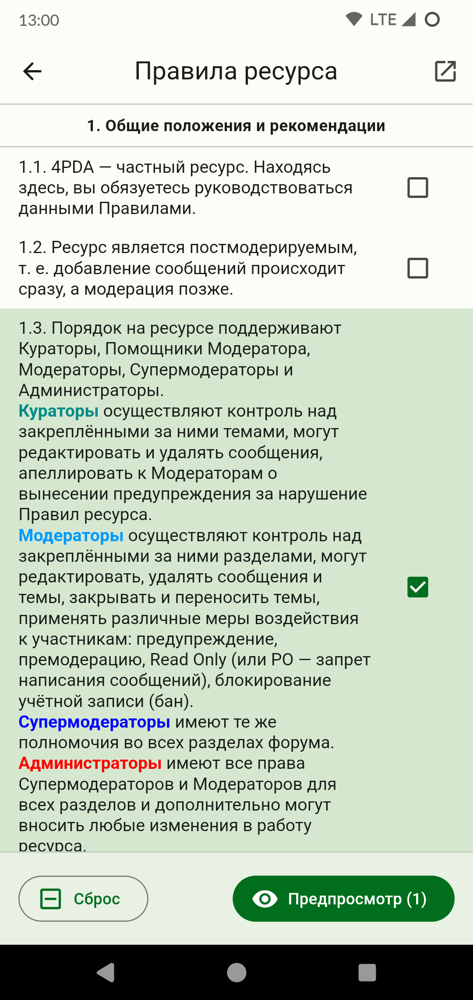

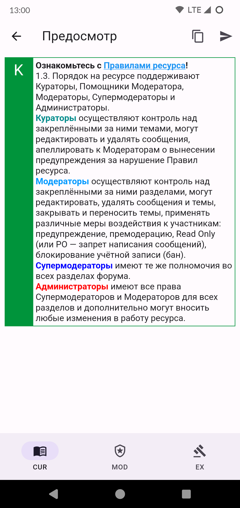 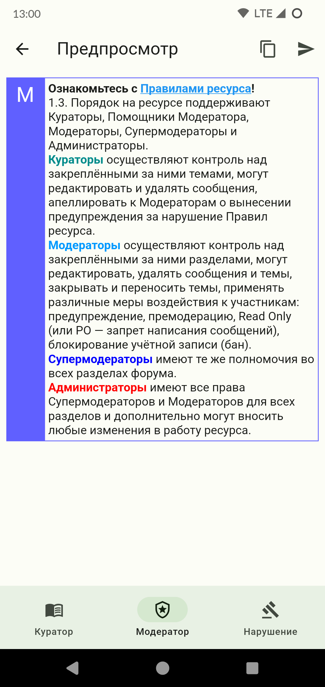 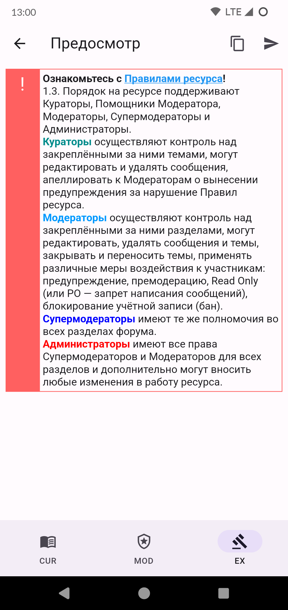

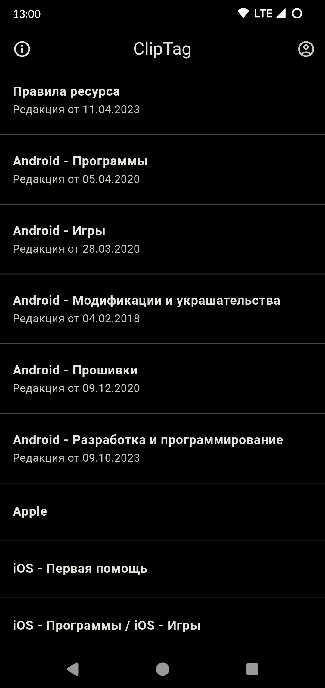 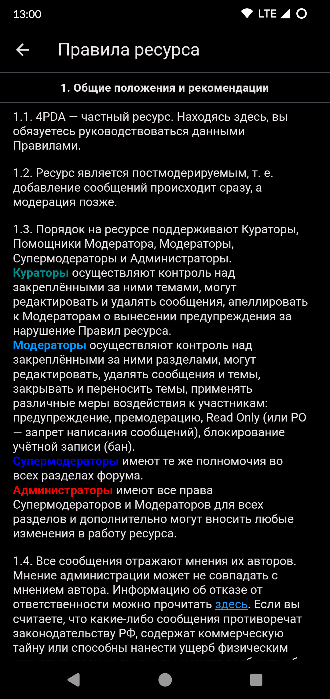 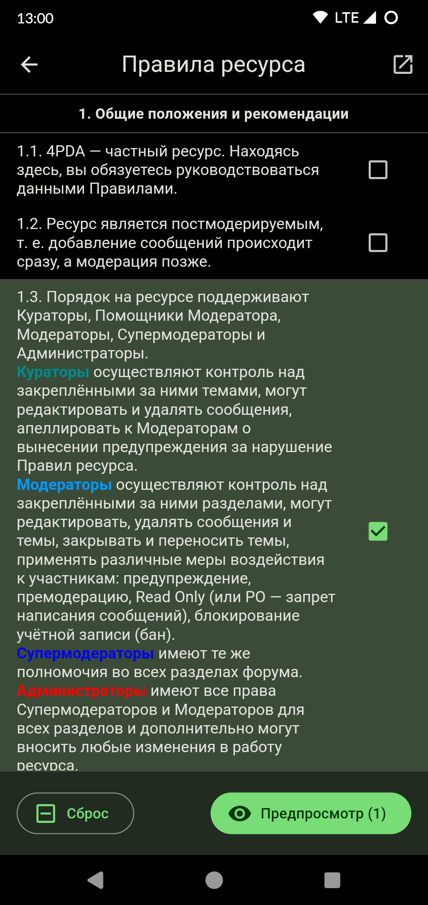

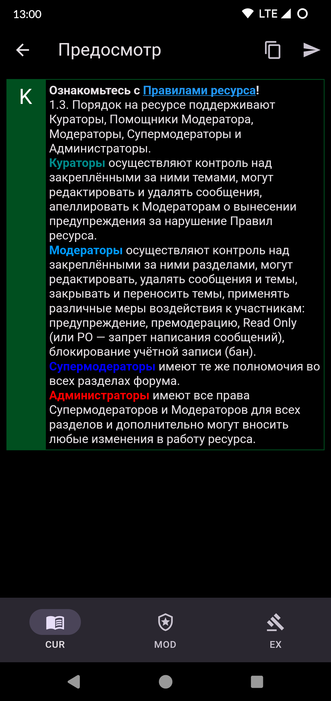 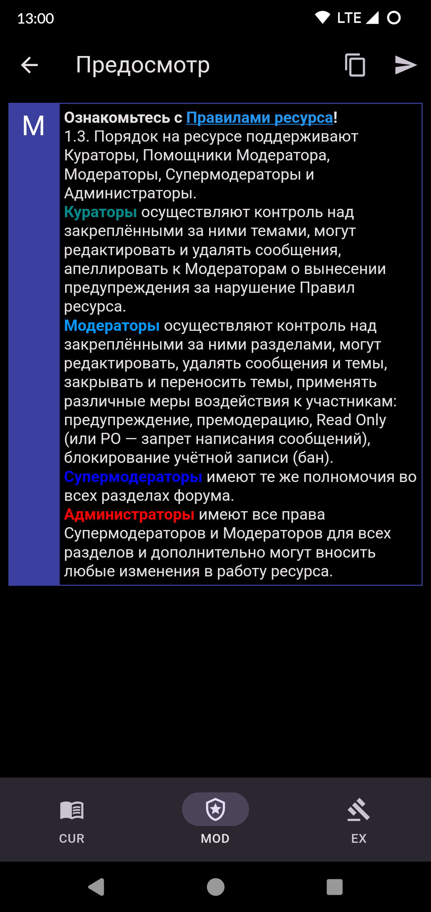 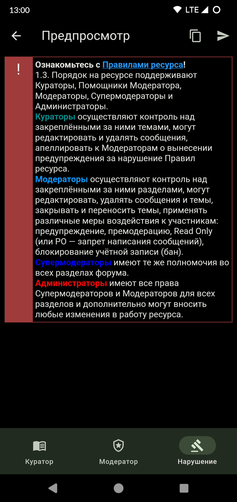
