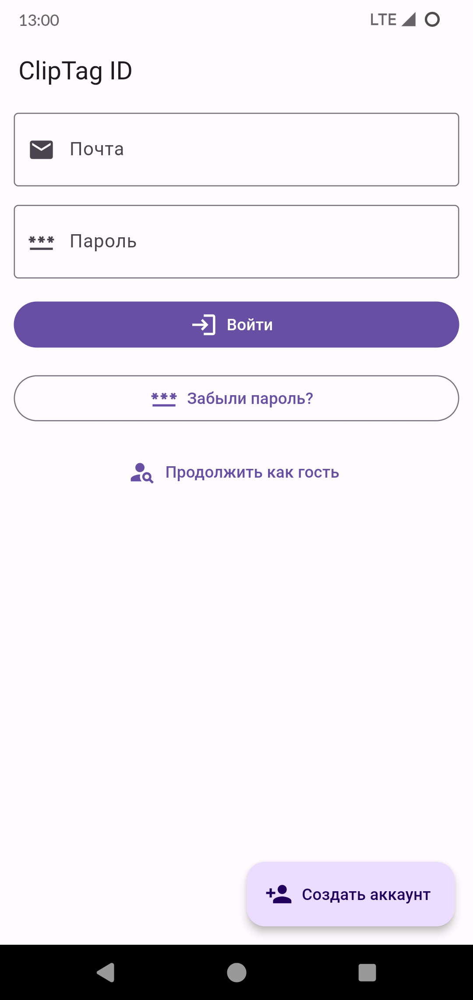

# ClipTag
Агрегатор правил 4PDA

### Скриншоты:
 

 

 

### Описание:
* Приложение ClipTag позволяет сформировать тег с правилами форума 4PDA

### Как пользоваться:
###### Список разделов:
1. Выберите раздел
###### Список правил:
2. Нажмите на правило чтобы перейти к предосмотру
3. Зажмите правило чтобы включить множественный выбор пунктов
###### Подготовка тега:
4. Нажмите кнопку копировать чтобы скопировать текст в буфер обмена
5. Нажмите кнопку отправить чтобы скопировать текст и открыть клиент 4PDA (если не установлен, откроется браузер)

### Особенности:
1. ОС: Android 4.4+
2. Тема: светлая и черная AMOLED
