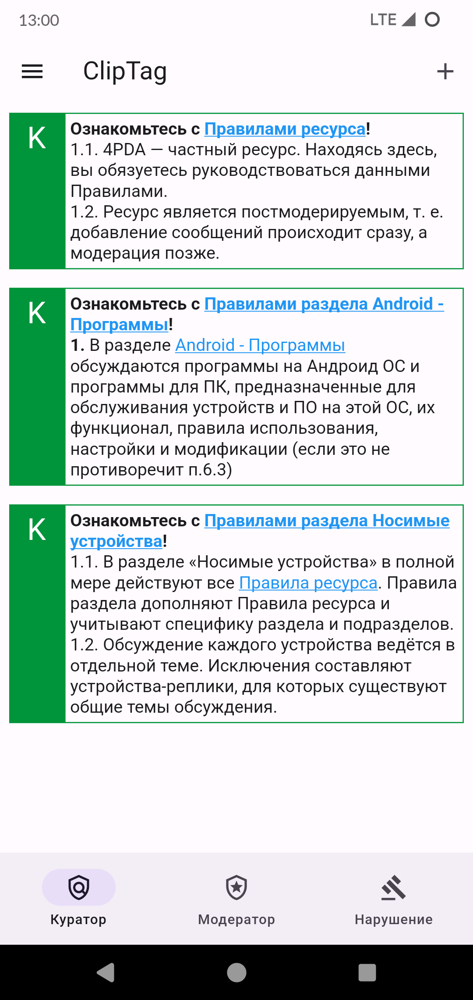
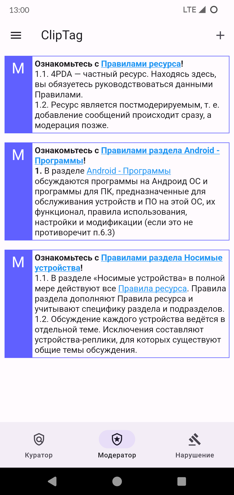
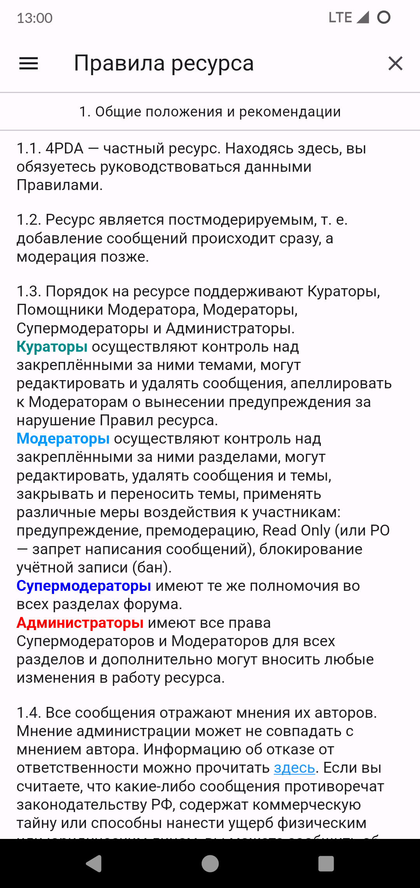
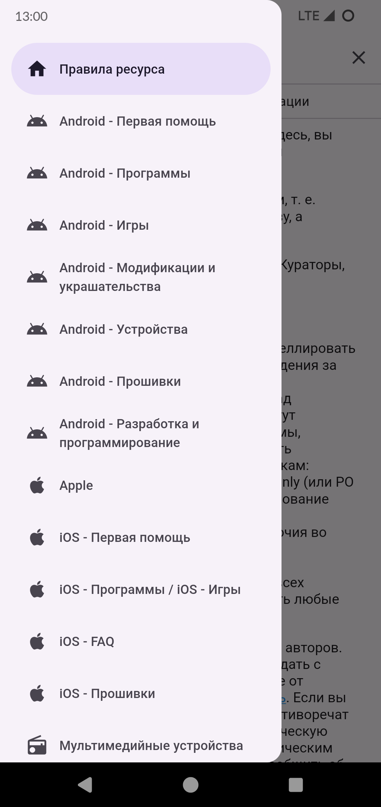
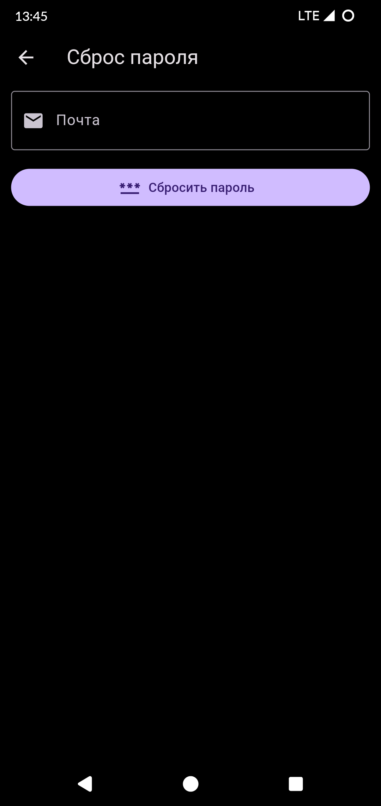
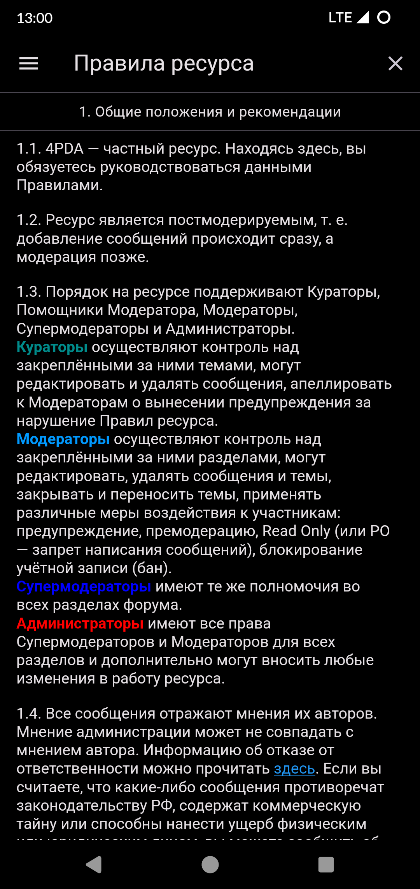

# ClipTag
Агрегатор правил 4PDA

### Полезные ссылки:
* [ClipTag Wiki](https://github.com/Keddnyo/clip_tag/wiki)
* [Условия использования приложения](https://github.com/Keddnyo/clip_tag/wiki/Terms-of-Service)

### Описание:
* Приложение ClipTag позволяет сформировать тег с правилами форума 4PDA

### Платформы:
1. [WEB версия](https://clip-tag.web.app)
2. Android 4.4 и выше

### Скриншоты:
                 
